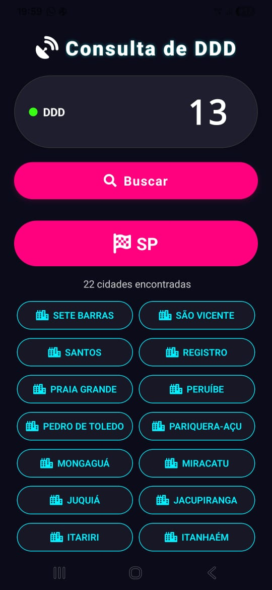

# Consulta de DDD

Aplicativo mobile desenvolvido com React Native (Expo) para consultar o estado e a lista de cidades pertencentes a um código DDD, utilizando a API pública BrasilAPI.

## Tecnologias

- React Native (Expo)
- TypeScript
- React Navigation (não utilizado, apenas navegação simples)
- Expo Vector Icons (FontAwesome)
- Animated API (animações nativas)

